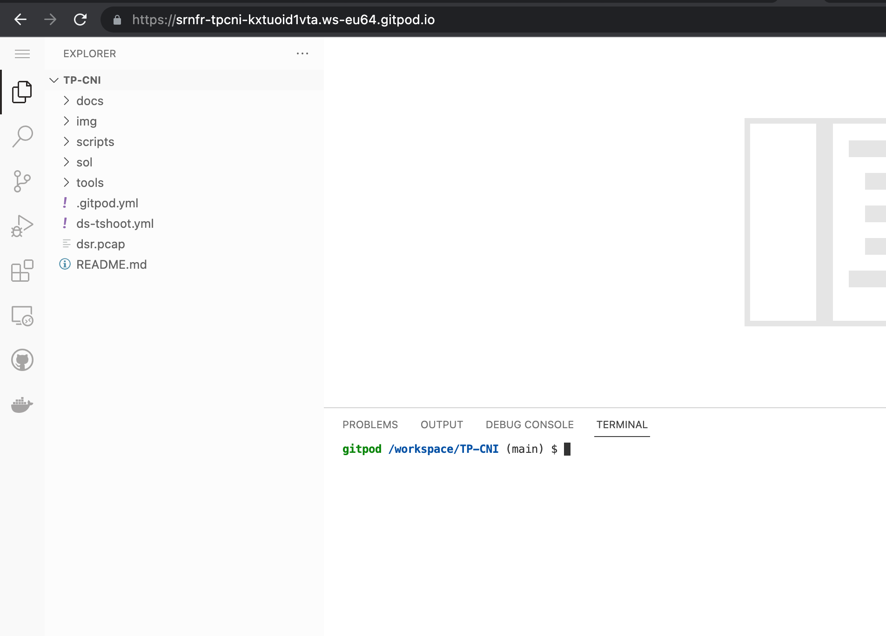

# Setup initial

Ce TP se déroule sur un cluster <ins>**DigitalOcean**<ins>.

## Sommaire
  * [But de l'exercice](#but-du-tp)
  * [Créer un compte GitHub](#créer-un-compte-github)
  * [Ouvrir un workspace dans GitPod](#ouvrir-un-workspace-dans-gitpod)
  * [Installer `kubectl`](#installer-kubectl)
  * [Installer `cilium-cli`](#installer-cilium-cli)
  * [Configurer le kubeconfig](#récupérer-et-installer-le-fichier-kubeconfig)
  * [Vérifier que l'accès `kubectl` fonctionne](#vérifier-que-laccès-kubectl-fonctionne)
  * [Accès aux Nodes](#accès-aux-nodes)
  * [Statut de Cilium CNI](#statut-de-cilium-cni-dans-le-cluster)
  * [Installer `stern` ](#installer-stern-sur-linux)

## But du TP
* Se familiariser et installer les outils nécessaires.
* Valider la configuration d'accès au cluster kubernetes individuel. 

## Créer un compte GitHub

[Github](https://github.com) fait office de SSO pour tout l'ecosysteme Cloud Native.
Creer ou utiliser votre compte, pour vous connecter dans Github.

## Ouvrir un workspace dans GitPod

[Gitpod](https://gitpod.com) est un IDE en ligne qui permet de travailler sur des projets sans avoir à installer quoi que ce soit sur son poste.

Une fois votre compte Github obtenu, vous pouvez vous connecter à Gitpod avec votre compte Github.
Dans le plan OpenSource (Free), vous aurez accès à 50 heures de travail par mois ce qui suffira pour ce cours, à partir du moment où vous détruisez votre environnement le soir (s'il n'est pas mis en hubernation par Gitpod automatiquement)

Lors de la créationde votre workspace, préciser l'URL suivante (c'est bien sûr celle de notre repo):
https://github.com/srnfr/TP-CNI
Cette étape est indispenable, notamment car nous précisons dans le gitpod.yaml une image qui contient `kubectl`.

Vous devriez obtenir un environnement de travail comme celui-ci:


Prenez le temps de vous familiariser avec l'interface de Gitpod :  éditeur de texte (en haut), terminal (en bas), arborescence de ficher à gauche, etc.


## Installer `kubectl` (sauf si GitPod, pré-installé)

[kubectl](https://kubernetes.io/docs/tasks/tools/install-kubectl/) est l'outil de ligne de commande pour interagir avec un cluster kubernetes.

Si vous utilisez Windows, voici un [lien direct de téléchargement](https://dl.k8s.io/release/v1.25.0/bin/windows/amd64/kubectl.exe).

```shell
kubectl version --client
```

## Installer `cilium-cli`

La partie "serveur" de Cilium sera pré-installée sur votre Cluster.

Pour installer le Command Line Interface (CLI) de Cilium sur votre *PC Windows*, suivre les instructions sur le [site de Cilium](https://docs.cilium.io/en/stable/gettingstarted/k8s-install-default/#install-cilium-cli). Pour plus facilité, voici le [lien direct de téléchargement du binaire pour Windows x64](https://github.com/cilium/cilium-cli/releases/download/v0.12.3/cilium-windows-amd64.tar.gz).

Pour installer le CLI sur *linux* ou *GitPod*, suivez les instructions suivantes:

```bash
export CILIUM_CLI_VERSION=$(curl -s https://raw.githubusercontent.com/cilium/cilium-cli/master/stable.txt)
export CLI_ARCH=amd64
if [ "$(uname -m)" = "aarch64" ]; then CLI_ARCH=arm64; fi
curl -L --fail --remote-name-all https://github.com/cilium/cilium-cli/releases/download/$CILIUM_CLI_VERSION/cilium-linux-$CLI_ARCH.tar.gz
sudo tar xzvfC cilium-linux-${CLI_ARCH}.tar.gz /usr/local/bin
rm cilium-linux-${CLI_ARCH}.tar.gz
```
Vérifier que l'installation s'est bien passée:
```bash
cilium version
```

## Télécharger et installer le fichier `kubeconfig`

L'animateur vous *fournit* le lien de téléchargement du fichier `kubeconfig`.
Enregistrez-le dans votre répertoire "home" sous le nom `.kube/config`

```bash
wget "<URL>" -O ~/.kube/config
```

## Vérifier que l'accès `kubectl` fonctionne

```bash
kubectl cluster-info
```

Ce qui doit donner :

```
Kubernetes control plane is running at https://xxxxxxxx
CoreDNS is running at https://xxxxxx/api/v1/namespaces/kube-system/services/kube-dns:dns/proxy
```

Pour note, une *cheat-sheet* des commandes kubectl est disponible [ici](https://kubernetes.io/fr/docs/reference/kubectl/cheatsheet/)

Vérifier que les Workers Nodes sont biens vus :
```bash
kubectl get nodes -o wide
```

Notez :
* leurs IP publiques et privées
* la version du container runtime
* la version du kernel sous-jaçent

Pourquoi ne voit-on pas les Master Nodes ?

## Installer le plugin manager `krew` (déjà installé sous GitPod)

Sous *Windows*, suivez la procédure décrite [ici](https://krew.sigs.k8s.io/docs/user-guide/setup/install/).

Sur *Gitpod*, `krew` est déjà installé.

La liste des pluings est disponible [ici](https://krew.sigs.k8s.io/plugins/).

## Accès aux Nodes

INstallons un plugin pour accéder aux Nodes du cluster.

```bash
kubectl krew index add kvaps https://github.com/kvaps/krew-index
kubectl krew install kvaps/node-shell
```

Choisir le nom d'un des Nodes vu précédemment (par ex "node-7o7xd"), et lancer un shell dessus:

```bash
$ kubectl node-shell node-7o7xd 
spawning "nsenter-vsine3" on "node-7o7xd"
If you don't see a command prompt, try pressing enter.
root@node-7o7xd:/#  
```

Sortir de ce pod :
```bash
root@node-7o7xd:/# exit
logout
pod "nsenter-vsine3" deleted
gitpod /workspace/TP-CNI (main) $ 
```

## Statut de Cilium CNI dans le cluster

Dans ce setup (i.e cluster managé chez l'opérateur de cloud DigitalOcean), Cilium est déjà installé comme CNI.

```shell
cilium version
```

```shell
cilium status
```

Lancez un test de connectivité pour vérifier que Cilium fonctionne à 100% :
```shell
cilium connectivity test
```


##  Installer `stern`

L'outil `stern` permet de facilement consulter les logs de plusieurs pods en même temps.
Le code est disponible sous [https://github.com/stern/stern](https://github.com/stern/stern).
Il est possible d'obtenir le même résultat en jonglant avec des kubectl `logs`

Pour l'installer :
  
  ```bash
kubectl krew install stern
```

Vérifions qu'il fonctionne :
```bash
kubectl stern -n kube-system cilium
```

---

[Revenir au sommaire](../README.md) | [TP Suivant](./TP02.md)
