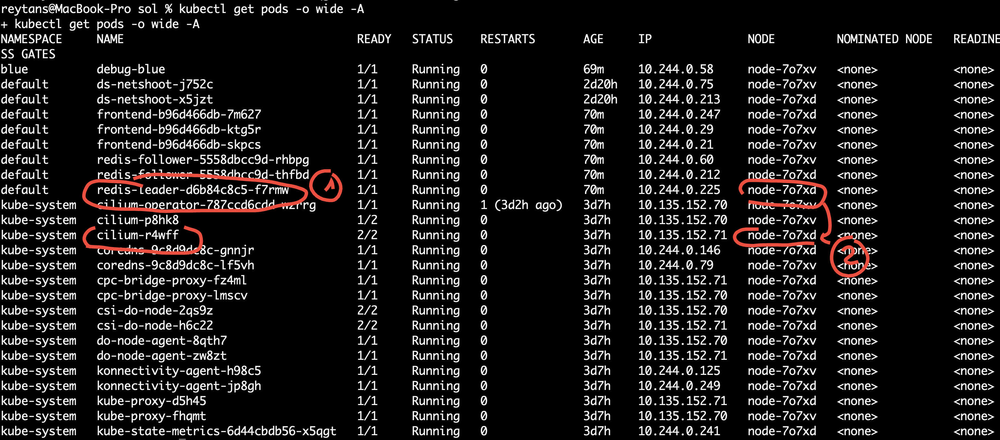

## Première Network Policy Ingress L3

Ce TP se déroule sur un cluster <ins>**DigitalOcean**<ins>.

## Sommaire
  * [But de l'exercice](#but-de-lexercice)
  * [Concevoir et Rédiger une première Network Policy Ingress](#concevoir-et-rédiger-une-première-network-policy-ingress)
  * [Appliquer la NetPol](#appliquer-la-netpol)
  * [Vérification](#vérification)
  * [Bonus : details dans Cilium](#bonus--details-dans-cilium)
  * [Nettoyer](#nettoyer)


## But du TP
* Rédiger une première Network Policy Ingress
* L'appliquer et tester
* Visualiser les logs Cilium


## Concevoir et Rédiger une première Network Policy Ingress
Créez un Network Policy (NP) en ingress qui :
* s'applique au composant `redis-leader` 
* qui permet l'accès depuis les  seuls `redis-follower` et les `frontend` (i.e aucun autre Pod ne peut y accéder)

Pour cela, utiliser :
* le [Network Policy Editor Cilium](https://editor.cilium.io/)
* le visualisateur [Orca](https://orca.tufin.io/netpol/)

Aidez-vous des labels appliqués sur les Pods :
```bash
kubectl get pods --show-labels
```
Voici une solution :

```yaml
## np-allow-from-redis-and-frontend.yaml
kind: NetworkPolicy
apiVersion: networking.k8s.io/v1
metadata:
  name: allow-from-redis-and-frontend
spec:
  policyTypes:
  - Ingress
  podSelector:
    matchLabels:
      app: redis
      role: leader
      tier: backend
  ingress:
  - from:
    - podSelector:
        matchLabels:
          app: guestbook
    - podSelector:
        matchLabels:
          app: redis         
```

Vérifions que ce YAML est syntaxiquement correct :  

```shell
kubectl apply -f np-allow-from-redis-and-frontend.yaml --dry-run=client
```

Pour info, une autre syntaxe aurait pu être :
```yaml
kind: NetworkPolicy
apiVersion: networking.k8s.io/v1
metadata:
  name: allow-from-redis-and-frontend
spec:
  policyTypes:
  - Ingress
  podSelector:
    matchLabels:
      app: redis
      role: leader
      tier: backend
  ingress:
  - from:
    - podSelector:
        matchExpressions:
          - {key: app, operator: In, values: [guestbook,redis]} 
```

## Application de la Network Policy

Appliquer cette politique
```shell
kubectl apply -f np-allow-from-redis-and-frontend.yaml
```

Vérifier qu'elle est bien appliquée
```shell
kubectl get netpol -A
```

```shell
kubectl describe netpol/allow-from-redis-and-frontend -n default
```
Pour note , dans le cas alternatif d'écriture de la NP, on aurait :
```
% kubectl describe netpol
Name:         allow-from-redis-and-frontend
Namespace:    default
Created on:   2022-09-28 12:02:13 +0200 CEST
Labels:       <none>
Annotations:  <none>
Spec:
  PodSelector:     app=redis,role=leader,tier=backend
  Allowing ingress traffic:
    To Port: <any> (traffic allowed to all ports)
    From:
      PodSelector: app in (guestbook,redis)
  Not affecting egress traffic
  Policy Types: Ingress
```

## Vérification

Identifier sur quel Node tourne le `redis-leader` afin de déterminer le Pod cilium qui tourne sur ce même Node :

```shell
kubectl get pods -o wide -A
```

 Le resultat est : 


Lancer `cilium monitor` sur le Pod Cilium dans une fenêtre séparée :
```shell
 kubectl exec -it cilium-xxxxx -n kube-system -- cilium monitor --type drop
```
Ce qui donne ceci lors du lancement ci-dessous des flux (bloqués) :
```
Press Ctrl-C to quit
level=info msg="Initializing dissection cache..." subsys=monitor
xx drop (Policy denied) flow 0x0 to endpoint 1333, identity 56671->25124: 10.244.0.58:37754 -> 10.244.0.225:6379 tcp SYN
xx drop (Policy denied) flow 0x0 to endpoint 1333, identity 56671->25124: 10.244.0.58:37756 -> 10.244.0.225:6379 tcp SYN
xx drop (Policy denied) flow 0x0 to endpoint 1333, identity 7391->25124: 10.244.0.60:39208 -> 10.244.0.225:6379 tcp SYN
xx drop (Policy denied) flow 0x6e59a6c7 to endpoint 1333, identity 7391->25124: 10.244.0.212:43320 -> 10.244.0.225:6379 tcp SYN
^C
Received an interrupt, disconnecting from monitor...
```

Vérifier que `redis-leader` n'est plus accessible depuis le Pod `debug-blue` crée dans le TP précedent
```shell
debug-blue# nmap -p 6379 -P0 redis-leader.default.svc
```

Vérifier que le svc `redis-leader` est bien accessible depuis le Pod `redis-follower`
```shell
kubectl exec -it redis-follower-xxxx -- redis-cli -h redis-leader.default.svc -p 6379
```

## Bonus Cilium

On peut avoir des détails dans Cilium :

Listons les détails du Endpoint `redis-leader` en nous connectant sur l'agent Cilium qui est sur le même Node que le Pod `redis-leader` :

```shell
kubectl -n kube-system exec -it pod/cilium-xxx -- cilium endpoint get -l k8s:role=leader
```
Repérer l'ID de l'Endpoint redis-leader :
```shell
kubectl -n kube-system exec -it pod/cilium-xxx -- cilium endpoint get -l k8s:role=leader -o=jsonpath='{[].id}'
```

## Cleanup : retirons la NP
```shell
kubectl delete -f np-allow-from-redis-and-frontend.yaml
```

---

[Revenir au sommaire](../README.md) | [TP Suivant](./TP07.md)
